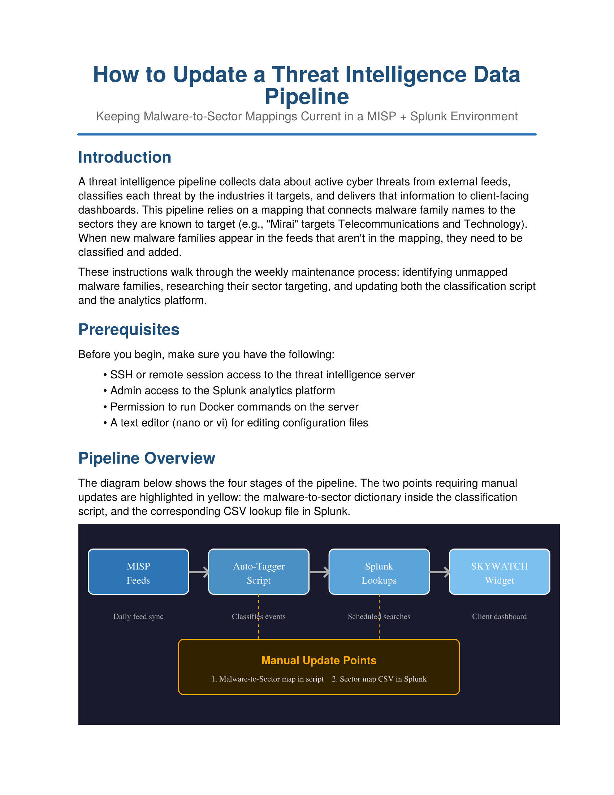
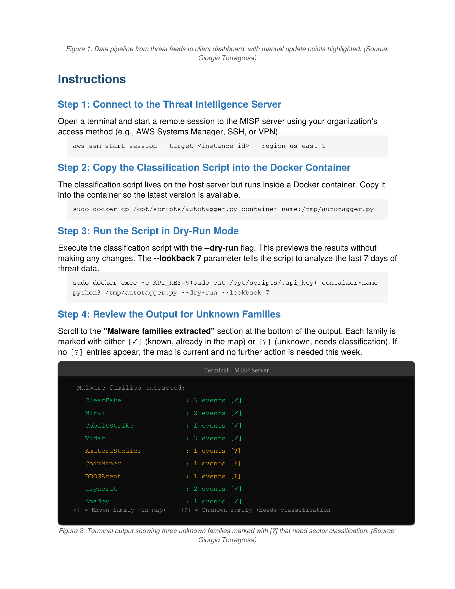
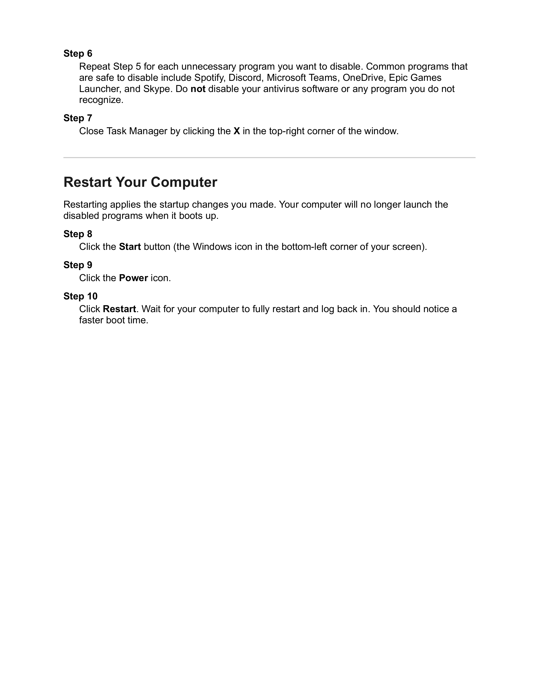

# How to Speed Up a Slow Windows Computer

This is a short instruction set I put together explaining how to speed up a slow Windows computer by disabling startup programs. The goal was to make something a nontechnical user could actually follow without getting lost, so I kept the steps plain and added screenshots for each stage.

[Download Instructions (PDF)](How_to_Speed_Up_a_Slow_Windows_Computer.docx.pdf)
