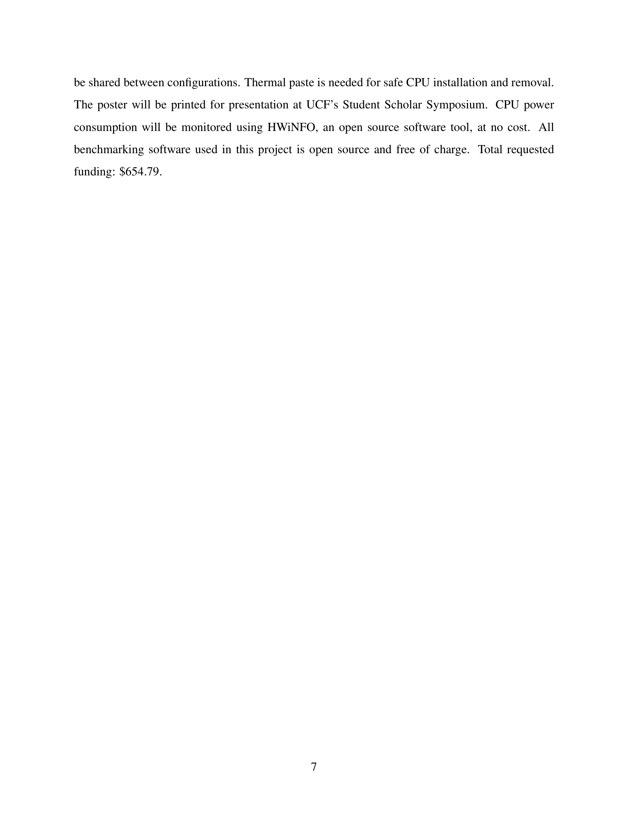

# Research Proposal

This is a research proposal I wrote for a UCF undergraduate research grant. The project compares Intel's hybrid core design against AMD's 3D V-Cache architecture on numerical computing workloads like LINPACK, FEA, and Monte Carlo simulation, which is an angle most consumer CPU reviews skip over.

[Download Proposal (PDF)](Research_Proposal.pdf)
